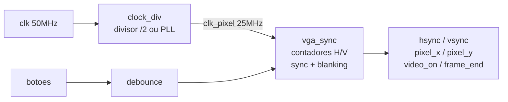

# fpga-vga-controller

Gerador de sincronismo VGA 640x480 @ 60Hz em Verilog.



## Estrutura

```sh
rtl/
  clock_div.v   divisor de clock (PLL no Quartus, /2 na simulacao)
  debounce.v    filtro de bounce para botoes
  clock.v       gerador de sync VGA
tb/
  tb_clock.v    testbench automatizado (13 testes VESA)
sim/            saidas de simulacao (.vcd, .vvp)
constraints/    arquivos de pinos para FPGA
```

## Como rodar

```bash
# pre-requisitos
sudo apt install iverilog gtkwave

# compilar e rodar testbench
make test

# abrir formas de onda
make wave

# limpar artefatos
make clean
```
