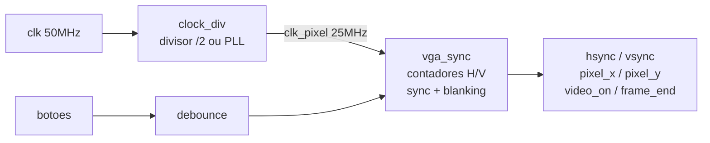

# fpga-vga-controller

Gerador de sincronismo VGA 640x480 @ 60Hz em Verilog.



## Estrutura

```
rtl/
  clock.v         gerador de sync VGA (nucleo)
  clock_div.v     divisor /2 ou PLL (Quartus)
  debounce.v      filtro de bounce para botoes
  vga_display.v   gerador de pixels RGB (4 modos)
  vga_top.v       top-level integrando tudo
tb/
  tb_clock.v      13 checks automaticos VESA
sim/
  sim_sdl.cpp     simulador Verilator + SDL2
constraints/      pinos para FPGA
```

## Como rodar

```bash
sudo apt install iverilog gtkwave verilator g++ libsdl2-dev

make test   # 13 checks VESA automaticos
make wave   # abre formas de onda no GTKWave
make run    # janela SDL2 com simulacao visual
make clean  # remove artefatos
```

## Simulacoes

Ambas as simulacoes rodam o mesmo Verilog ciclo a ciclo — sem aleatoriedade, sem variacao. O resultado e sempre identico.

### make test — Icarus Verilog

Roda `tb_clock.v` que instancia so o `clock.v`, deixa o clock correr e mede os sinais. Nao mostra nada visual — imprime `[PASS]` ou `[FAIL]` no terminal.

```
-- Horizontal --        mede uma linha completa (800 ciclos)
  total pixels = 800    conta quantos ciclos ate pixel_x voltar a 0
  pixels ativos = 640   conta ciclos com video_on=1
  largura hsync = 96    conta ciclos com hsync=0
  front porch H = 16    ciclos entre fim do video e inicio do sync
  back porch H = 48     ciclos entre fim do sync e inicio do proximo video

-- Vertical --          mede um frame completo (525 linhas)
  total linhas = 525
  linhas ativas = 480
  largura vsync = 2
  front porch V = 10
  back porch V = 33
  frame_end pulsa 1x

-- Integridade --
  video_on = h_video AND v_video sempre
  display == video_on
```


### make run — Verilator + SDL2

Compila o `vga_top.v` inteiro em C++ via Verilator e abre uma janela SDL2. O loop roda 800×525 ciclos de clock por frame e captura o RGB de cada pixel visivel.

```
M   alterna modo de exibicao
P   pausa / continua animacao
S   alterna velocidade (lento / rapido)
C   muda cor do bouncing box
F   fullscreen
```

Os 4 modos validam a logica de `vga_display.v`:

| Modo | O que mostra | O que valida |
|------|-------------|--------------|
| 00 Bouncing Box | quadrado colorido quicando | animacao frame a frame, colisao nas bordas |
| 01 Checkerboard | xadrez 32x32 | `pixel_x[5] XOR pixel_y[5]` correto |
| 10 Mira | cruz vermelha + circulo + grid | coordenadas absolutas corretas |
| 11 Barras de cor | 8 barras verticais SMPTE | divisao de `pixel_x` por 80 correta |
