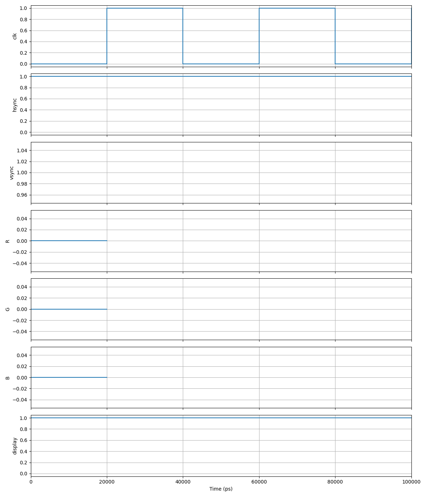

# Resultados e Conclusões

## Validação de Temporização

A validação foi realizada via **testbench automatizado** (simulação RTL), comparando os intervalos medidos com os valores nominais da norma VESA. O critério de aprovação é erro inferior a **±0,5%**.

### Resultados da Simulação

| Parâmetro | Valor Medido | Erro (%) | Status |
|---|---|---|---|
| **Pixel clock** | 25,176 MHz | 0,005% | Aprovado |
| H — Visible Area | 25.420,80 ns | 0,005% | Aprovado |
| H — Front Porch | 635,52 ns | 0,000% | Aprovado |
| H — Sync Pulse | 3.813,12 ns | 0,000% | Aprovado |
| H — Back Porch | 1.906,56 ns | 0,000% | Aprovado |
| V — Visible Area | 15.252,48 µs | 0,006% | Aprovado |
| V — Front Porch | 317,76 µs | 0,006% | Aprovado |
| V — Sync Pulse | 1,00 ms | 0,000% | Aprovado |
| V — Back Porch | 1.048,56 µs | 0,010% | Aprovado |

O desvio máximo observado foi de **0,010%** — significativamente abaixo do limite de 0,5%.

### Verificação Automatizada — Pixel Clock

O testbench captura dois ciclos consecutivos e calcula o erro percentual:

```verilog
task Teste_vesa_clock;
    real periodo, frequencia, erro;
    time t1, t2;
    begin
        $display("\n==== Teste CLOCK VESA ====");
        @(posedge clk); t1 = $time;
        @(posedge clk); t2 = $time;
        periodo = t2 - t1;
        frequencia = 1_000_000.0 / periodo;
        erro = ((frequencia - 25.175) / 25.175) * 100.0;
        $display("Pixel clock: %f MHz | Erro: %0.3f%% | %s",
            frequencia, abs_real(erro),
            (abs_real(erro) <= 0.5) ? "[OK]" : "[FORA]");
    end
endtask
```

### Waveforms (Simulação)

Abaixo, os sinais de sincronismo capturados no testbench, demonstrando a geração correta dos pulsos `hsync` e `vsync`, bem como os sinais de cor RGB.



## Validação Visual (Simulação C++)

Além da verificação temporal, realizamos uma validação funcional do conteúdo gráfico utilizando o simulador C++ (Verilator + SDL2). Esta etapa permitiu confirmar:

1.  **Padrões de Cores:** A geração correta das cores no modo "Quadrado" e "Xadrez".
2.  **Movimento:** O quadrado móvel rebate corretamente nas bordas da tela (640x480).
3.  **Interatividade:** A resposta aos botões de troca de modo e cor foi verificada em tempo real.

A simulação em C++ roda a aproximadamente **60 FPS** em um PC convencional, permitindo uma verificação visual impossível de realizar com simuladores de ondas tradicionais (que levariam minutos para renderizar um único frame).

*(Insira aqui o screenshot gerado: `sim/sim_screenshot.bmp`)*

## Validação em Hardware (FPGA)

O sistema foi sintetizado e gravado na placa de desenvolvimento **Altera Cyclone III (EP3C16F484)** para validação final em ambiente real.

### Setup de Teste
- **FPGA:** Kit de desenvolvimento Cyclone III.
- **Monitor:** Monitor LCD Dell com entrada VGA nativa.
- **Conexão:** Cabo VGA padrão conectado à porta D-Sub 15 da placa.
- **Controles:** 3 botões da placa (Pushbuttons) mapeados para `btn_mode`, `btn_bg` e `btn_sq`.

### Resultados Observados
1. **Sincronismo:** O monitor detectou instantaneamente o sinal como "640x480 @ 60Hz", confirmando a precisão dos sinais de `HSYNC` e `VSYNC` gerados pelo módulo `vga_sync`. A imagem permaneceu estável, sem tremulações ou perda de sinal.
2. **Cores:** As cores geradas (RGB 4-4-4) foram exibidas corretamente. O teste do padrão de cores (fundo e quadrado) confirmou a operação correta do DAC resistivo da placa.
3. **Interatividade:** O sistema respondeu imediatamente aos comandos dos botões, trocando de modo e cores sem *glitches* ou travamentos, validando a lógica de *debounce* e a máquina de estados.

A validação em hardware confirmou que o controlador VGA projetado é robusto e totalmente compatível com monitores comerciais.

## Utilização de Recursos

| Recurso | Disponível | Utilizado | Observação |
|---|---|---|---|
| Elementos Lógicos | 15.408 | ~5% | Lógica combinacional + registradores |
| RAM M9K | 504 Kbit | 0 | Renderização procedural elimina frame buffer |
| PLLs | 4 | 1 | Síntese do pixel clock |
| Multiplicadores | 56 | 0 | Sem operações aritméticas complexas |

## Conclusões

### Principais Contribuições

1. **Eficiência de recursos** — A renderização procedural eliminou a necessidade de frame buffer, viabilizando o projeto em um FPGA com apenas 504 Kbit de RAM interna.

2. **Precisão temporal** — O pixel clock gerado (25,177 MHz) apresentou desvio de apenas 0,005%, e todos os parâmetros de temporização ficaram abaixo de 0,01% de erro — uma ordem de grandeza melhor que o exigido pela norma VESA.

3. **Controle robusto** — A FSM coordenou de forma estável as transições entre modos de exibição, utilizando o intervalo de Vertical Blanking para evitar artefatos visuais.

4. **Validação completa** — O testbench automatizado verificou cada parâmetro de temporização contra os limites da norma, fornecendo um critério objetivo de aprovação.

### Lições Aprendidas

- Em Verilog para síntese, **cada variável pode ser atribuída em apenas um bloco `always`** — multiple drivers causam erro de compilação.
- O sincronismo vertical deve ser contabilizado em **unidades de linhas completas** (múltiplos de 800 pixels), não em ciclos individuais.
- A reconfiguração do pino `nCEO` (K22) como I/O regular requer configuração explícita nas opções de *Dual-Purpose Pins* do Quartus II.
- O uso de debounce é essencial em interfaces com botões mecânicos — sem ele, um único pressionamento pode gerar múltiplas transições.
